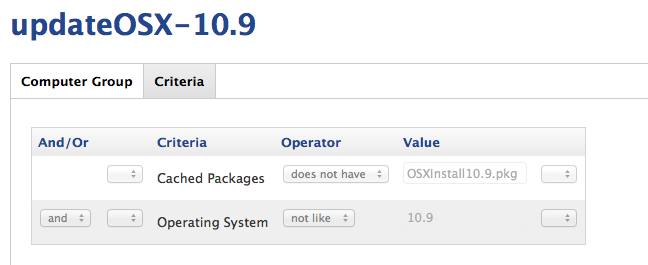
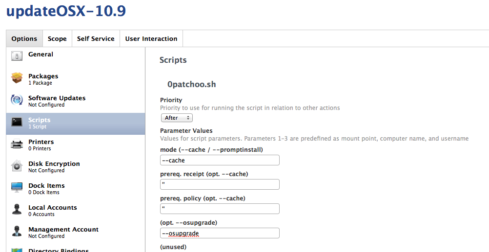
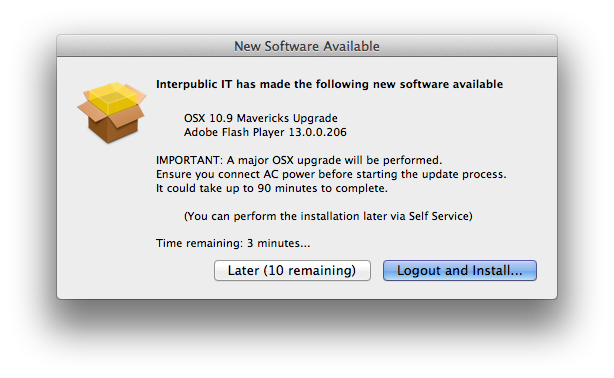
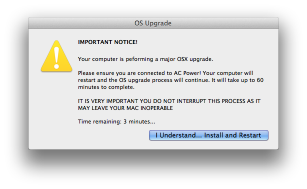

Deploying Major OSX Upgrades
----------------------------

Deploying major OSX Upgrades build with the excellent [createOSXInstallPkg](https://code.google.com/p/munki/downloads/list) is identical to deploying any other pkg.

**IMPORTANT:** *Ensure that when you upload the pkg into Casper Admin, you set the "requires reboot" pkg metadata. This is read from the JSS by junki and will be required to complete the OSX Upgrade!*

### Create a deployment Smart Group

Scope your smart group (it's probably a good idea also do hardware compatibility checks in this scope - for simplicity's sake, we will ignore that for this exmaple).

As you did before, make sure that it hasn't been cached to prevent it repeatedly caching.

### Create a policy

I will skip over the general tab, as it's identical to the [standalone installers](deploying_standalone_Installers.md). When you are configuring the script section it should look like this.

* Script: `0junki.sh`
* Priority: `after` 
* Mode (1st param): `--cache`
* (opt. --forceinstall / --osupgrade): `--osupgrade`
* pkg descript: `OSX 10.9 Mavericks Upgade`
* pkg filename: `OSXInstall10.9.pkg`

`--osupgrade` does two things:  

1. It present user warnings about the OSX Upgrade (connect to AC power, it could take over an hour etc).
2. It prevents Apple Updates from being installed during the install process, and flushes the Software Update Cache (/Library/Updates/).

### User Interface for OSX Upgrades

If the user chooses to install, there will be a second warning (for them to ignore :) ). There are similar warnings if **firmware updates** are detected as part of the Apple Software Update installations.

___

That's it! As per createOSXInstallPkg, junki will install the OSX pkg and reboot the Mac. The unattended OSX Installation will take over and upgrade your Macs.
