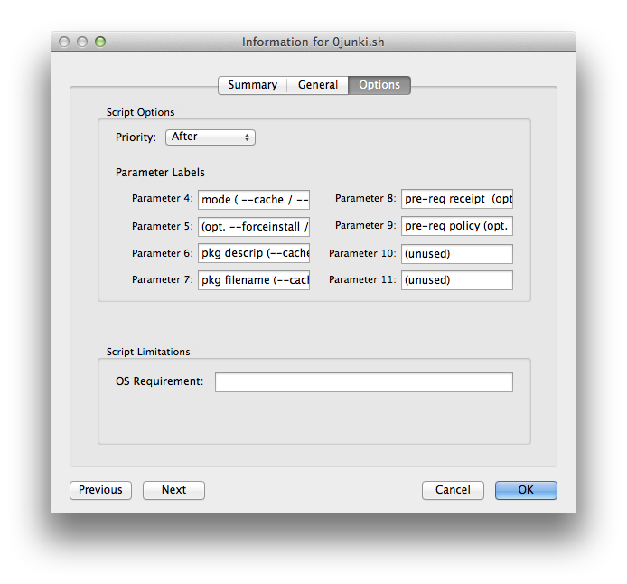

Install junki.sh
----------------
Once you've [configured junki.sh](configuring_junki.sh.md) you need to upload it into Casper. I recommend that you leave it named `0junki.sh`. The preceding *0* means it will be alphabetically sorted to the top in the JSS, and you need to find the script easily when creating policies.

Simply drag and drop the script into Casper Admin, replicate your CDPs (if using legacy fileshare CDPs).

In order to make junki.sh more usable in the JSS it's a good idea to label the input parameters.

Double click to *Get Info* and click on the *Options* tab.

Set the Parameter Labels as follows (don't worry, we'll explain what these are later)

Parameters  | Value
----------- | ------------- 
Parameter 4 | mode ( --cache / --promptinstall )
Parameter 5 | (opt. --forceinstall / --osupgrade) 
Parameter 6 | pkg descrip (--cache) 
Parameter 7 | pkg filename (--cache)
Parameter 8 | pre-req receipt  (opt.  --cache) 
Parameter 9 | pre-req policy (opt.  --cache) 
Parameter 10| (unused) 
Parameter 11| (unused)
 
