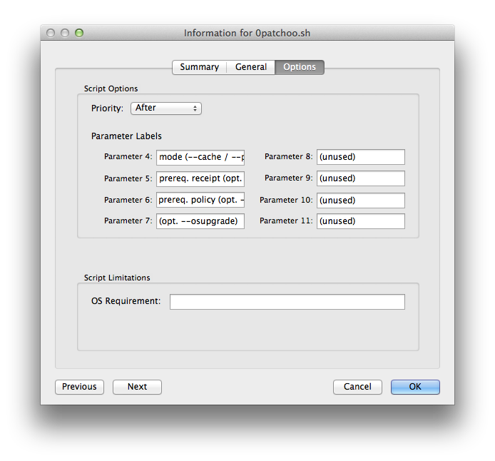

Install patchoo.sh
----------------
Once you've [configured patchoo.sh](configuring_patchoo.sh.md) you need to upload it into Casper. I recommend that you leave it named `0patchoo.sh`. The preceding *0* means it will be alphabetically sorted to the top in the JSS, and you need to find the script easily when creating policies.

Simply drag and drop the script into Casper Admin, replicate your CDPs (if using legacy fileshare CDPs).

In order to make patchoo.sh more usable in the JSS it's a good idea to label the input parameters.

Double click to *Get Info* and click on the *Options* tab.

Set the Parameter Labels as follows (don't worry, we'll explain what these are later)

Parameters  | Value
----------- | ------------- 
Parameter 4 | mode (--cache / --promptinstall)
Parameter 5 | prereq. receipt (opt. --cache) 
Parameter 6 | prereq. policy (opt. --cache) 
Parameter 7 | (opt. --osupgrade)
Parameter 8 | (unused) 
Parameter 9 | (unused) 
Parameter 10| (unused) 
Parameter 11| (unused)
 
